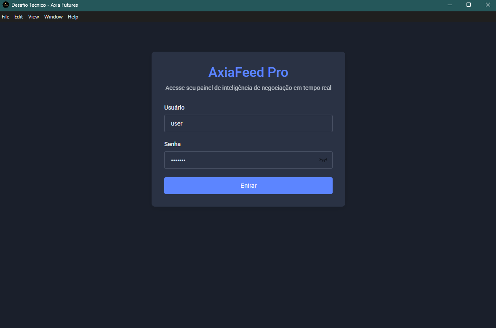
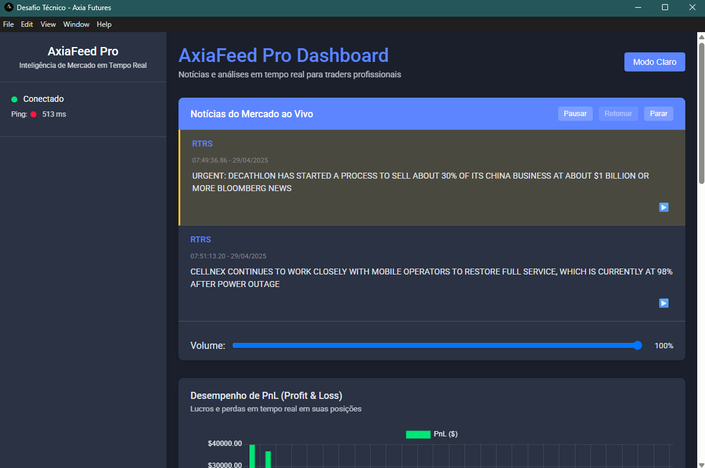
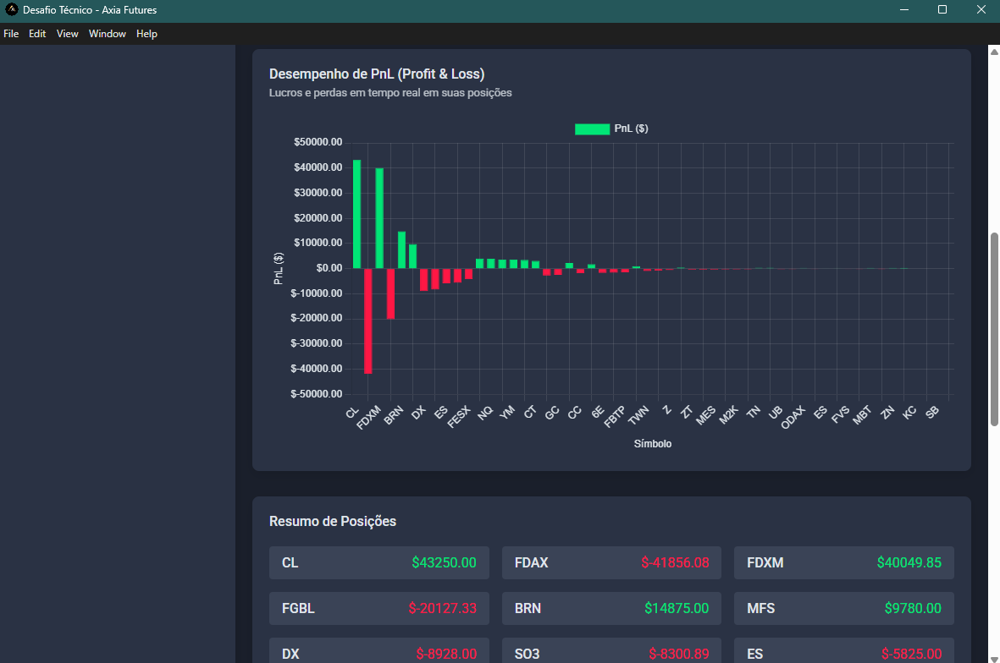

# Desafio Tecnico Axia

## Descrição
Desenvolvimento de um aplicativo desktop de comunicação em tempo real. O aplicativo inclui autenticação via login, um feed de noticias recebido por WebSocket e um leitor de texto básico com controle de volume (Text-to-Speech). 


## 1. Tecnologias Utilizadas
- **Electron**: Framework para criação de aplicações desktop multiplataforma.
- **NodeJS**: Plataforma para execução de código JavaScript no servidor.
- **WebSocket**: Comunicação em tempo real entre cliente e servidor.
- **SpeechSynthesis**: API nativa do JavaScript que permite a síntese de voz (conversão de texto em fala, ou text-to-speech)
- **JavaScript**, **HTML** e **CSS**: Desenvolvimento da interface e lógica da aplicação.


## 2. Pré-requisitos
Antes de iniciar o projeto, certifique-se de ter instalado:
- **NodeJS**: [Baixar aqui](https://nodejs.org/)
- **npm**: Gerenciador de pacotes do Node.js (já incluso na instalação do Node.js).


## 3. Execução e Build do Projeto
- 3.1 Clone o repositório
```bash
git clone https://github.com/brunocesarfranco/DesafioTecnicoAxia.git
```

- 3.2 Acesse a pasta do projeto
```bash
cd DesafioTecnicoAxia
```

- 3.3 Instale as dependências
```bash
npm install
```

- 3.4 Inicie a aplicação
```bash
npm start
```

## 4. Instalação
- 4.1 Faça o download e instale o arquivo "Desafio Tecnico Axia Setup 1.0.0"

- 4.2 Por padrão o arquivo é instaldo no caminho:
```bash
C:\Users\<SeuUsuario>\AppData\Local\Programs\desafiotecnicoaxia
```

## 5. Acessos
- Login: user
- Password: pass123

## 6. Controle de Versões
- O desenvolvimento seguiu GitFlow com as branchs develop e main, porem não foi necessário criar tags.

## 7. Screenshots

- 7.1 Login


- 7.2 Feed de Noticias com Text-to-Speech


- 7.3 Grafico PnL e Resumo de Posições

